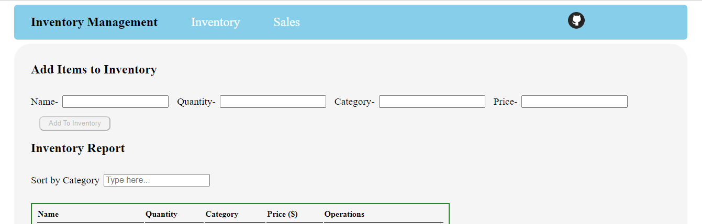

# Inventory Management App

This app aims to help businesses efficiently manage their inventory, track sales, and generate reports for informed decision-making.

#### Live Link - https://inventory-management-gamma-seven.vercel.app/
#### Backend - https://github.com/ShivamT16/assignment-18

## Features-

Inventory Management
<li>Add Item to Inventory</li>
Users can add a new item to their inventory with details and can categorize items for better organization.  
  
<li>Update and Delete Items</li>
Users can update item details or delete existing items in their inventory.  
  
Sales Management  
  
<li>Record Sales Transactions</li>
Users can record sales transactions by specifying the item.  

The app calculates the total revenue for each transaction.
<li>View Sales History</li>
Users can view a list of past sales transactions, including item details and total revenue.  

Users can filter sales history by date range.

## Tech Used

Frontend-  
Javascript  
HTML  
ReactJs  
Redux  

Backend-  
NodeJs  
Express  
MongoDB 
